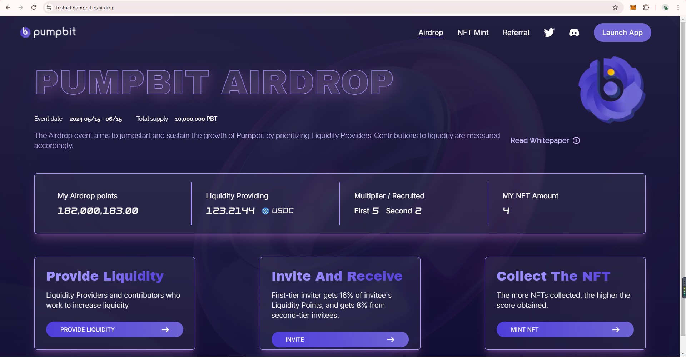

# Perpetual Contract Crypto Trading and Staking Platform

**Overview**
------------

PumpBit is a comprehensive crypto trading platform designed to facilitate perpetual contract trading on the B2 network and offer a staking feature for liquidity pools. The platform is built using Next.js for the frontend, Node.js for the backend, and utilizes Hardhat for smart contract development. The backend integrates with the Binance API to fetch real-time cryptocurrency prices.

------------

## Social
- [Follow us on Twitter](https://twitter.com/MerlinFutures_)
- [Join our Discord](https://discord.gg/7urJ9Yuczb)
  
<table>
  <tr>
    <td align = "center">    
            
    </td>
  </tr>
  <tr>
    <td align = "center">    
            
    </td>
  </tr>
  <tr>
    <td align = "center">    
            
    </td>
  </tr>
  <tr>
    <td align = "center">    
            
    </td>
  </tr>
  <tr>
    <td align = "center">    
            
    </td>
  </tr>
  <tr>
    <td align = "center">    
            
    </td>
  </tr>
</table>

## Key Features

- **Perpetual Contract Trading**:
  - **B2 Network Integration**: Trade perpetual contracts on the B2 network, leveraging its robust infrastructure for seamless trading experiences.
  - **Real-time Data Analytics**: Access real-time market data and analytics to make informed trading decisions.
  - **Order Management**: Users can create market or limit orders, which are executed automatically with user-set margins.
  - **Automatic Position Management**: Positions are automatically closed based on user-set take-profit (TP) or stop-loss (SL) levels.
  - **Manual Position Closure**: Users can manually close positions at any time.

- **Staking for Liquidity Pools**:
  - **Liquidity Pool Staking**: Stake your assets in liquidity pools to earn rewards, enhancing overall platform liquidity and stability.
  - **Reward Mechanisms**: Earn tokens as rewards for participating in staking activities, with an annual percentage yield (APY) of up to 25%.

- **Price Decision Algorithm**:
  - **Zero Sum Position AMM (ZSPM)**: An advanced algorithm designed to optimize price decisions by ensuring that the total value of all positions remains constant, thereby maintaining market equilibrium and minimizing risks.

## Technical Details

- **Frontend**: Developed using **Next.js**, ensuring a fast, scalable, and user-friendly interface.
- **Backend**: Built with **Node.js**, providing a robust and efficient server-side logic for handling trading operations and API integrations.
  - **Binance API Integration**: Utilizes the Binance API to fetch real-time cryptocurrency prices, ensuring accurate and timely trading decisions.
- **Smart Contracts**: Built with **Hardhat**, providing secure, efficient, and well-tested contract logic.
- **Blockchain Integration**: Utilizes the B2 network for perpetual contract trading, ensuring high performance and reliability.

## Architecture

- **Frontend (Next.js)**: Handles user interactions and displays real-time data.
- **Backend (Node.js)**: Manages trading logic, API connections, and data processing.
- **Smart Contracts (Hardhat)**: Execute trades and manage staking on the blockchain.

## Getting Started
This project source code is confidential because we signed an NDA to protect the security of the project.

## Contributing

Contributions are welcome! Please submit pull requests with detailed descriptions of changes.

### Zero Sum Position AMM (ZSPM) Algorithm

The ZSPM algorithm is designed to maintain a balanced market by ensuring that the total value of all positions remains constant. This approach helps in minimizing risks and optimizing price decisions. The algorithm continuously monitors market conditions and adjusts positions accordingly to maintain equilibrium.

**How ZSPM Works:**

1. **Real-time Market Monitoring**: Continuously fetches real-time market data to assess current market conditions.
2. **Position Adjustment**: Automatically adjusts positions based on market fluctuations to maintain a zero-sum balance.
3. **Risk Management**: Integrates risk management strategies to protect against adverse market movements.

